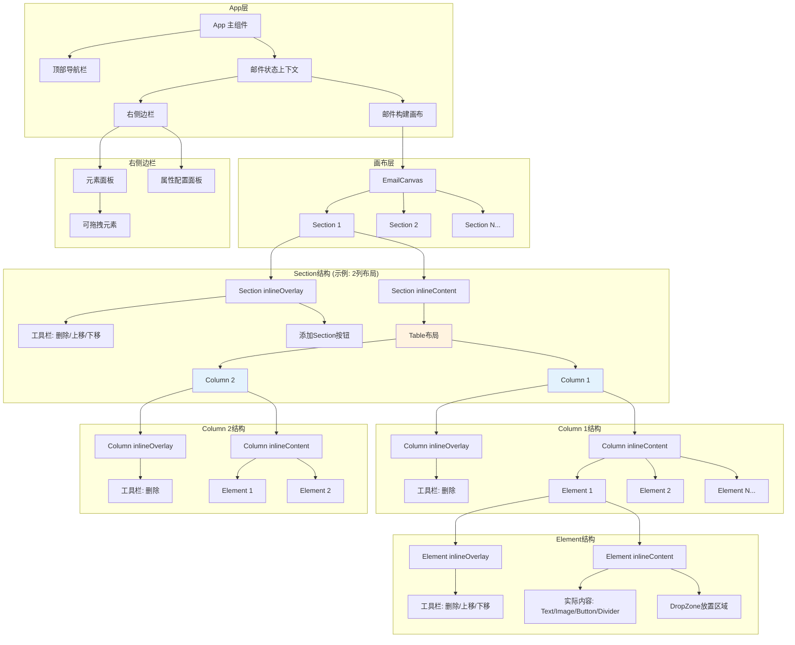

# 邮件构建器 - React + Fluent UI

## 架构概览

### 三层Frame架构（基于微软设计）

采用微软的统一Frame结构，所有层级（Section/Column/Element）都使用相同的包装模式：

```
inlineFrame (容器)
├── inlineOverlay (编辑器UI层 - 仅在选中时显示)
│   ├── inlineToolbar (工具栏 - 点击选中后才显示)
│   │   └── ContextButtons (上下文按钮：删除、上移、下移)
│   └── AddButtons (添加按钮)
└── inlineContent (实际内容层 - 导出到最终邮件)
```

**说明**：Frame提供悬浮（hover）和选中（selected）两种交互状态，工具栏仅在选中时显示。详细的交互逻辑和样式规范见第4节"邮件构建画布"。

### 组件关系图



### 水平布局示意图（基于微软实际HTML结构）

下图展示了一个2列Section的实际布局结构：

```
┌─────────────────────────────────────────────────────────────────┐
│ <div data-section="true">                                       │
│   <table class="outer" role="presentation">                     │
│     <tbody>                                                      │
│       <tr>                                                       │
│         <th role="presentation"> ← Section外层th               │
│           <table class="containerWrapper"> ← 列容器表格         │
│             <tbody>                                              │
│               <tr>                                               │
│ ┌─────────────────────────┬─────────────────────────┐          │
│ │ <div class="inlineFrame">│<div class="inlineFrame">│ ← Col包装│
│ │ ┌─────────────────────┐ │ ┌─────────────────────┐ │          │
│ │ │inlineOverlay        │ │ │inlineOverlay        │ │          │
│ │ │[🗑️ 删除]           │ │ │[🗑️ 删除]           │ │          │
│ │ └─────────────────────┘ │ └─────────────────────┘ │          │
│ │ ┌─────────────────────┐ │ ┌─────────────────────┐ │          │
│ │ │inlineContent        │ │ │inlineContent        │ │          │
│ │ │<th columnContainer> │ │ │<th columnContainer> │ │          │
│ │ │  <table>            │ │ │  <table>            │ │          │
│ │ │    <tr>             │ │ │    <tr>             │ │          │
│ │ │      <th inner>     │ │ │      <th inner>     │ │          │
│ │ │  ┌───────────────┐  │ │ │  ┌───────────────┐  │ │          │
│ │ │  │Element Frame  │  │ │ │  │Element Frame  │  │ │          │
│ │ │  │ ┌───────────┐ │  │ │ │  │ ┌───────────┐ │  │ │          │
│ │ │  │ │Overlay    │ │  │ │ │  │ │Overlay    │ │  │ │          │
│ │ │  │ │[⬆️⬇️🗑️] │ │  │ │ │  │ │[⬆️⬇️🗑️] │ │  │ │          │
│ │ │  │ └───────────┘ │  │ │ │  │ └───────────┘ │  │ │          │
│ │ │  │ ┌───────────┐ │  │ │ │  │ ┌───────────┐ │  │ │          │
│ │ │  │ │Content    │ │  │ │ │  │ │Content    │ │  │ │          │
│ │ │  │ │Text/Image │ │  │ │ │  │ │Button     │ │  │ │          │
│ │ │  │ └───────────┘ │  │ │ │  │ └───────────┘ │  │ │          │
│ │ │  └───────────────┘  │ │ │  └───────────────┘  │ │          │
│ │ │      </th>           │ │ │      </th>           │ │          │
│ │ │    </tr>             │ │ │    </tr>             │ │          │
│ │ │  </table>            │ │ │  </table>            │ │          │
│ │ │</th>                 │ │ │</th>                 │ │          │
│ │ └─────────────────────┘ │ └─────────────────────┘ │          │
│ │ </div>                  │ </div>                  │          │
│ └─────────────────────────┴─────────────────────────┘          │
│               </tr>                                              │
│             </tbody>                                             │
│           </table>                                               │
│         </th>                                                    │
│       </tr>                                                      │
│     </tbody>                                                     │
│   </table>                                                       │
│ </div>                                                           │
└─────────────────────────────────────────────────────────────────┘
```

**关键点（基于微软实际HTML）**：

1. **Section层**：`<div data-section="true">` 包装

   - **注意：Section本身没有inlineFrame包装**
   - 直接包含外层 `<table class="outer">`
   - 使用 `<th role="presentation">` 作为Section容器

2. **Column层**：`<div class="inlineFrame">` 作为 `<tr>` 的直接子元素

   - **关键：虽然`<div>`在`<tr>`内不符合HTML标准，但这是微软的实际实现**
   - 每个Column的 `<div class="inlineFrame">` 包含：
     - `<div class="inlineOverlay">` - 工具栏UI
     - `<div class="inlineContent">` - 包含 `<th class="columnContainer">`
   - Column内部使用嵌套表格结构
   - **使用 `<th>` 而不是 `<td>`**

3. **Element层**：每列内部垂直堆叠

   - 每个Element是 `<div class="inlineFrame">`
   - 包含 inlineOverlay（工具栏）和 inlineContent
   - 通过上下移动按钮可以改变同一列内元素的顺序

4. **HTML导出时的处理**：

   - 移除所有 `<div class="inlineFrame">` 和 `<div class="inlineOverlay">`
   - 只保留 `<div class="inlineContent">` 中的 `<th>` 元素
   - 确保最终HTML符合邮件客户端标准

## 核心数据结构

邮件使用嵌套数组结构表示，并支持全局样式配置：

```typescript
// 元素类型
type ElementType = 'text' | 'image' | 'button' | 'divider' | 'qrcode' | 'customcode';

// 邮件元素
type EmailElement = {
  id: string;
  type: ElementType;
  content: any;  // 元素的内容（文本、图片URL、按钮文字等）
  styles: Record<string, any>;  // 样式配置
};

// Section布局类型
type LayoutType = 'single' | 'two-equal' | 'two-left' | 'two-right' | 'three';

// 邮件Section
type EmailSection = {
  id: string;
  columns: EmailElement[][];  // 列数组，每列包含多个元素
  columnWidths?: string[];    // 列宽配置（如：['50%', '50%']）
  styles?: {                  // Section样式
    backgroundColor?: string;
    padding?: string;
    paddingTop?: string;
    paddingBottom?: string;
    paddingLeft?: string;
    paddingRight?: string;
  };
};

// 全局邮件样式（对应微软的设计）
type GlobalStyles = {
  layoutMaxWidth?: string;      // 默认600px
  fontFamily?: string;          // 默认Arial, Verdana, sans-serif
  bodyTextSize?: string;        // 默认14px
  bodyTextColor?: string;       // 默认#000
  outerBackground?: string;     // 默认#FFFFFF
};

// 邮件数据
type EmailData = {
  sections: EmailSection[];     // 所有 section
  subject?: string;             // 邮件主题
  globalStyles?: GlobalStyles;  // 全局样式
};

// Frame类型（用于FrameWrapper）
type FrameType = 'section' | 'column' | 'element';

// 工具栏按钮配置
type ToolbarButton = {
  id: string;
  icon: React.ReactNode;
  label: string;
  onClick: () => void;
  disabled?: boolean;
};
```

**示例**：一个 2 列的 section，左列有 3 个文本和 1 个分隔线，右列有 2 个按钮：

```typescript
{
  id: 'section-1',
  columns: [
    [text1, text2, text3, divider],  // 第 1 列
    [button1, button2]                // 第 2 列
  ],
  columnWidths: ['60%', '40%'],
  styles: {
    backgroundColor: '#f5f5f5',
    padding: '20px'
  }
}
```

## 实施计划

### 1. 项目初始化与结构

**安装依赖**：

```bash
npm create vite@latest email-builder -- --template react-ts
cd email-builder
npm install @fluentui/react-components @fluentui/react-icons
npm install @dnd-kit/core @dnd-kit/sortable @dnd-kit/utilities
npm install react-quill quill
npm install uuid
```

**文件夹结构**：

```
src/
  components/
    Header/              # 顶部导航栏
      Header.tsx
      Header.css
    EmailBuilder/        # 邮件构建器核心
      Canvas/            # 画布核心
        EmailCanvas.tsx
        EmailCanvas.css
        SectionRenderer.tsx
        SectionRenderer.css
        ColumnWrapper.tsx      # Column层Frame包装器
        DropZone.tsx
        DropZone.css
      Elements/          # 元素渲染器
        TextElement.tsx
        TextElement.css
        ImageElement.tsx
        ImageElement.css
        ButtonElement.tsx
        ButtonElement.css
        DividerElement.tsx
        DividerElement.css
        ElementRenderer.tsx
      Frame/             # Frame架构核心组件
        FrameWrapper.tsx       # 统一Frame包装器
        toolbarConfig.tsx      # 工具栏配置
        Frame.css              # Frame样式
      Toolbar/           # 工具栏（保留用于向后兼容）
        HoverToolbar.tsx
        HoverToolbar.css
      EmailBuilder.tsx
      EmailBuilder.css
    Sidebar/             # 右侧边栏
      ElementsPanel.tsx       # 元素拖拽面板
      ElementsPanel.css
      PropertiesPanel.tsx     # 属性配置面板
      PropertiesPanel.css
      Sidebar.tsx
      Sidebar.css
  context/
    EmailContext.tsx     # 全局状态管理
  utils/
    htmlGenerator.ts     # HTML 生成工具（微软模板）
    idGenerator.ts       # ID 生成
    demoContent.ts       # 演示内容
  types/
    email.types.ts       # TypeScript 类型定义
    index.ts             # 类型导出
  App.tsx
  App.css
  main.tsx
  index.css
```

### 2. 顶部导航栏（Header）

使用 Fluent UI v9 组件实现现代化设计：

**左侧**：

- 返回箭头按钮（`ArrowLeft24Regular` 图标）
- 标题区域：
  - 主标题 "Email Builder Test"（16px，加粗）
  - 状态标签 "Draft - Unsaved"（12px，灰色）

**右侧**：

- Save 按钮（带 `Save24Regular` 图标）
- Check content 按钮（带 `CheckmarkCircle24Regular` 图标）
- 撤销按钮（`ArrowUndo24Regular` 图标，仅图标显示）
- 重做按钮（`ArrowRedo24Regular` 图标，仅图标显示）
- **HTML 按钮（带 `Code24Regular` 图标）**：
  - 点击后打开弹窗显示生成的邮件 HTML 代码
  - 使用 `generateEmailHTML()` 工具函数生成代码
  - 弹窗内提供 "Copy to Clipboard" 和 "Close" 按钮
  - 代码以等宽字体显示，支持滚动和垂直拉伸
- Test send 按钮（带 `Play24Regular` 图标）
- **Ready to send 主按钮（蓝色 Primary 按钮）**

**功能特性**：

- 集成 `EmailContext` 获取邮件数据
- HTML 按钮完全实现，可生成并显示邮件 HTML 代码
- HTML 弹窗使用 Fluent UI `Dialog` 组件
- 一键复制 HTML 到剪贴板功能
- 其他按钮保留 `onClick` 接口供未来扩展

**样式规范**：

- 按钮高度：32px
- 图标颜色：#0078d4（蓝色）
- 文字颜色：#323130（深灰）
- Hover 背景：#f3f2f1（浅灰）
- Primary 按钮：#0078d4 背景，白色文字
- 所有按钮带平滑过渡动画（0.1s ease）
- 边框颜色：#e1dfdd（浅灰）

### 3. 邮件构建画布（核心功能）

#### 3.1 状态管理（EmailContext）

创建集中式上下文管理所有邮件数据和操作，作为画布的核心支撑：

**核心状态**：

- `emailData: EmailData` - 邮件数据结构（包含sections和globalStyles）
- `selectedElementId: string | null` - 当前选中的元素（点击后）
- `selectedSectionId: string | null` - 当前选中的 section（点击后）
- `selectedColumnId: string | null` - 当前选中的 column（点击后）
- `hoveredElementId: string | null` - 当前悬浮的元素（鼠标移入）
- `hoveredSectionId: string | null` - 当前悬浮的 section（鼠标移入）
- `hoveredColumnId: string | null` - 当前悬浮的 column（鼠标移入）

**核心操作**：

**Section操作**：

- `addSection(layout: LayoutType, position: number)` - 插入新 section
- `deleteSection(sectionId: string)` - 删除 section
- `selectSection(sectionId: string)` - 选中 section（点击）
- `hoverSection(sectionId: string | null)` - 设置悬浮 section（鼠标移入/移出）
- `updateSectionStyles(sectionId: string, styles: Partial<EmailSection['styles']>)` - 更新 section 样式

**Element操作**：

- `addElement(sectionId: string, columnIndex: number, elementType: ElementType, position: number)` - 插入元素
- `updateElement(elementId: string, updates: Partial<EmailElement>)` - 更新元素
- `deleteElement(elementId: string)` - 删除元素
- `moveElement(elementId: string, targetSection: string, targetColumn: number, targetPosition: number)` - 移动元素
- `selectElement(elementId: string)` - 选中元素（点击）
- `hoverElement(elementId: string | null)` - 设置悬浮元素（鼠标移入/移出）

**Column操作**：

- `selectColumn(sectionId: string, columnIndex: number)` - 选中 column（点击）
- `hoverColumn(sectionId: string, columnIndex: number | null)` - 设置悬浮 column（鼠标移入/移出）
- `updateColumnWidth(sectionId: string, columnIndex: number, width: string)` - 更新列宽

**辅助函数**：

- `findElement(elementId: string)` - 查找元素及其位置信息

#### 3.2 Frame架构（基于微软设计）

**FrameWrapper组件**（统一的Frame包装器）：

所有层级（Section/Column/Element）都使用FrameWrapper包装，提供统一的编辑体验：

```typescript
<FrameWrapper
  frameType="section" | "column" | "element"
  isSelected={boolean}            // 是否选中（点击后）
  isHovered={boolean}             // 是否悬浮（鼠标移入）
  isParentHovered={boolean}       // 父级是否被悬浮
  onSelect={() => {}}             // 选中回调
  onDelete={() => {}}             // 删除回调
  onMoveUp={() => {}}             // 上移回调
  onMoveDown={() => {}}           // 下移回调
  canMoveUp={boolean}             // 是否可以上移
  canMoveDown={boolean}           // 是否可以下移
  showAddButtons={boolean}        // 是否显示添加按钮
  onAppend={() => {}}             // 添加按钮回调
>
  {/* 实际内容 */}
</FrameWrapper>
```

**Frame结构层次**：

1. **inlineFrame**：容器层

   - **悬浮状态（Hover）**：
     - 当前悬浮：添加 `.hovered` 类，边框变为浅蓝色（`#a6d5fa`），背景色变为浅灰色（`#f8f8f8`）
     - 父级悬浮：添加 `.parent-hovered` 类，边框变为更浅的蓝色（`#d0e9ff`）
   - **选中状态（Selected）**：
     - 添加 `.selected` 类，边框变为深蓝色（`#0078d4`）
     - 显示 inlineToolbar 工具栏

2. **inlineOverlay**：编辑器UI层（仅在选中时显示）

   - inlineToolbar：工具栏（删除、上移、下移按钮）- **只在点击选中后显示**
   - AddButtons：添加Section/Block按钮

3. **inlineContent**：内容层（导出到邮件）

   - 包含实际的邮件内容
   - 导出HTML时保留，overlay层被移除

**交互逻辑流程**：

```
用户操作               →  视觉反馈
─────────────────────────────────────────────────────
鼠标移入Element        →  Element: 浅蓝边框 + 浅灰背景
                          Column: 更浅蓝边框
                          Section: 更浅蓝边框
                          不显示工具栏

鼠标移入Column         →  Column: 浅蓝边框 + 浅灰背景
                          Section: 更浅蓝边框
                          不显示工具栏

鼠标移入Section        →  Section: 浅蓝边框 + 浅灰背景
                          不显示工具栏

点击Element            →  Element: 深蓝边框
                          显示Element工具栏（⬆️⬇️🗑️）
                          清除其他选中状态

点击Column             →  Column: 深蓝边框
                          显示Column工具栏（🗑️）
                          清除其他选中状态

点击Section            →  Section: 深蓝边框
                          显示Section工具栏（⬆️⬇️🗑️）
                          清除其他选中状态
```

#### 3.3 上下文工具栏（简化版）

所有Frame类型（Section/Column/Element）统一使用简化的工具栏按钮：

**工具栏显示规则**：

- **悬浮时（Hover）**：不显示工具栏，仅显示边框和背景色变化
- **选中时（Click）**：显示工具栏，根据Frame类型显示对应按钮

**工具栏按钮**：

- ⬆️ **上移**：与上方相邻元素交换位置（当不是第一个时显示）
- ⬇️ **下移**：与下方相邻元素交换位置（当不是最后一个时显示）
- 🗑️ **删除**：删除当前元素/Column/Section

**按钮组合**：

- **Element工具栏**：上移 + 下移 + 删除
- **Column工具栏**：删除（Column不支持移动）
- **Section工具栏**：上移 + 下移 + 删除

**移动逻辑**：

- **Element层级**：与同一Column内的上/下Element交换位置
- **Section层级**：与上/下Section交换位置
- 移动按钮根据位置动态启用/禁用

#### 3.4 放置区域（Drop Zones）

使用 `@dnd-kit` 的 `useDroppable` Hook 实现放置区域：

**放置区域类型**：

1. **Element之间的间隙**：
   ```typescript
   const { setNodeRef, isOver } = useDroppable({
     id: `dropzone-element-${sectionId}-${columnIndex}-${position}`,
     data: { type: 'element-gap', sectionId, columnIndex, position }
   });
   ```

2. **空Column区域**：
   ```typescript
   const { setNodeRef, isOver } = useDroppable({
     id: `dropzone-column-${sectionId}-${columnIndex}`,
     data: { type: 'empty-column', sectionId, columnIndex }
   });
   ```

3. **Section之间的间隙**：
   ```typescript
   const { setNodeRef, isOver } = useDroppable({
     id: `dropzone-section-${position}`,
     data: { type: 'section-gap', position }
   });
   ```


**视觉反馈**：

```css
.dropzone {
  border: 2px dashed transparent;
  min-height: 40px;
  transition: all 0.2s ease;
}

.dropzone.is-over {
  border-color: #0078d4;
  background-color: rgba(0, 120, 212, 0.05);
}
```

**动态显示逻辑**：

- 拖拽开始时（`onDragStart`）：显示所有可用的 Drop Zones
- 拖拽悬浮时（`onDragOver`）：高亮当前悬浮的 Drop Zone
- 拖拽结束时（`onDragEnd`）：隐藏所有 Drop Zones

#### 3.5 内联编辑与属性配置

**交互逻辑**（统一使用单击）：

**1. 点击非文本元素**（Section/Column/Image/Button/Divider）：

- 选中该元素（显示蓝色边框 + 工具栏）
- 右侧边栏切换为**属性配置面板**
- 显示该元素的所有可配置属性

**2. 点击文本元素**：

- 选中该文本元素（显示蓝色边框 + 工具栏）
- 文本进入**可编辑模式**（contentEditable）
- 显示**富文本编辑工具栏 (**富文本编辑器**)：**技术选项用Quill.js，固定在 Canvas 上方（Header 下方，iframe 外部）。注意邮件兼容性，生成的 HTML 需转换为邮件兼容格式（替换 `<div>` 为 `<p>`，确保样式内联）
- 右侧边栏显示**简化属性面板**（仅包含 Outer spacing 配置）

#### 

#### 3.6 添加按钮

- **Prepend Section Button**：在当前Section前添加
- **Append Section Button**：在当前Section后添加
- **Append Block Button**：在当前Element后添加（占位）

### 4. 右侧边栏（Tab 切换设计）

#### 4.1 UI 布局

**结构**：右侧边栏分为两部分

- **内容区**：显示当前 Tab 的面板内容（占主要空间）
- **Tab 栏**：垂直排列的 Tab 切换按钮（最右侧，约 50px 宽）

**布局示意**：

```
┌─────────────────┬───┐
│                 │ 📄│ Elements Tab
│  面板内容区      │ ⚙️│ Properties Tab
│                 │ 📚│ Templates Tab (扩展)
│                 │ 🕒│ History Tab (扩展)
└─────────────────┴───┘
```

#### 4.2 Tab 列表

包含Elements, Properties, 这两个是必须的，留一个Personal（待扩展）

#### 4.3 切换逻辑

**自动切换**（保留原有逻辑）：

- 选中元素/Section/Column 时 → 自动切换到 **Properties** Tab
- 取消选中时 → 保持当前 Tab（不自动切回）

**手动切换**（新增功能）：

- 用户点击 Tab → 切换到对应面板
- 即使选中元素，也可以手动切换回 **Elements** 查看可用元素

**状态指示**：

- 当前激活的 Tab 显示高亮（蓝色背景）
- 未激活的 Tab 显示灰色
- 禁用的 Tab（扩展功能）显示半透明

#### 4.4 面板内容

#### 元素面板（默认）

**Elements 区域**：

- Text（文本图标）
- Image（图片图标）
- Button（按钮图标）
- QR code（二维码图标 - 占位符）
- Divider（分隔线图标）
- Custom code（代码图标 - 占位符）

每个元素卡片可拖拽，使用 Fluent UI 的 Card 组件。

**Layout section types 区域**：

- 1 column（单列布局）
- 1:2 column（左窄右宽）
- 2 column（两列等宽）
- 2:1 column（左宽右窄）
- 3 column（三列等宽）
- Custom（自定义布局 - 占位符）

显示布局的可视化预览，可拖拽到画布。

#### 属性配置面板（选中元素时）

根据选中的元素类型动态显示表单：

**文本元素属性**：

- 文本内容（textarea）
- 字体大小、颜色、对齐方式
- 内边距（上下左右）

**图片元素属性**：

- 图片 URL
- Alt 文本
- 宽度、高度
- 对齐方式
- 链接 URL

**按钮元素属性**：

- 按钮文字
- 链接 URL
- 背景色、文字颜色
- 内边距、圆角
- 对齐方式

**分隔线元素属性**：

- 颜色
- 粗细
- 宽度（百分比）

**Section 属性**：

- 背景颜色
- 内边距
- 列宽比例

### 5. 拖拽系统（@dnd-kit）

**技术选型**：使用 **@dnd-kit/core** 实现拖拽功能

#### 5.1 核心概念

**DndContext**：拖拽上下文提供者，包裹整个应用

```typescript
<DndContext
  sensors={sensors}                    // 传感器配置
  collisionDetection={closestCenter}   // 碰撞检测算法
  onDragStart={handleDragStart}        // 开始拖拽
  onDragEnd={handleDragEnd}            // 结束拖拽
  onDragOver={handleDragOver}          // 拖拽悬浮
>
  {/* 应用内容 */}
</DndContext>
```

**Draggable**：可拖拽元素

```typescript
const { attributes, listeners, setNodeRef, isDragging } = useDraggable({
  id: 'unique-id',
  data: { type: 'element', content: {...} }  // 传递数据
});
```

**Droppable**：放置区域

```typescript
const { setNodeRef, isOver } = useDroppable({
  id: 'dropzone-id',
  data: { columnIndex, position }
});
```

**DragOverlay**：拖拽预览覆盖层（Portal渲染）

```typescript
<DragOverlay>
  {activeId ? <ElementPreview id={activeId} /> : null}
</DragOverlay>
```

#### 5.2 拖拽场景

**场景1：从侧边栏拖拽元素到画布**

**场景2：画布内元素重排序**

**场景3：Section之间拖拽排序**

**场景4：拖拽布局到画布**

### 6. 邮件 HTML 生成器（微软关注点分离设计）

#### 6.1 核心设计模式

**微软的巧妙设计：关注点分离**

**编辑器视图**（当前状态）：

- `<head>`：放置编辑器相关样式（工具栏、选择框、悬停效果等）
- `<body>`：包含邮件内容 + 邮件配置（meta + style）

**导出邮件时**：

- 移除 `<head>` 中的编辑器样式
- 提取 `<body>` 中的 `<meta>`、`<title>`、`<style>` 到 `<head>`
- 保留纯净的邮件内容结构

#### 6.2 Body 结构（直接照搬微软）

```html
<body style="padding-top: 70px; padding-left: 30px; padding-right: 30px;">
    <!-- 标准邮件 Meta 标签 -->
    <meta http-equiv="Content-Type" content="text/html; charset=utf-8">
    <meta name="viewport" content="width=device-width, initial-scale=1.0">
    <title>My Email Subject</title>
    <meta name="referrer" content="never">
    <meta name="format-detection" content="telephone=no,date=no,address=no,email=no">
    <meta name="x-apple-disable-message-reformatting">

    <!-- 邮件内容样式 -->
    <style>
        body { font-family: Arial, Verdana, sans-serif; font-size: 14px; color: #000; background-color: #fff; }
        h1 { color: #000; font-size: 34px; font-weight: normal; font-family: Verdana, Arial, sans-serif; margin: 0px; }
        h2 { color: #333; font-size: 24px; font-weight: normal; font-family: sans-serif; margin: 0px; }
        h3 { color: #000; font-size: 16px; font-weight: normal; font-family: Verdana, Arial, sans-serif; margin: 0px; }
        p { font-family: Arial, Verdana, sans-serif; font-size: 14px; color: #000; }
        li { font-family: Arial, Verdana, sans-serif; font-size: 14px; color: #000; }
        a { font-family: Arial, Verdana, sans-serif; color: #0082dd; text-decoration: none; }
        
        .buttonWrapper { margin: 10px 0px; }
        .buttonClass { 
            font-family: Arial, Verdana, sans-serif; 
            font-size: 16px; 
            border-radius: 4px; 
            color: white; 
            background-color: rgb(7, 66, 171); 
            padding: 10px 20px; 
            text-decoration: none; 
        }
        .divider { border-top: 2px solid silver; margin: 10px 0px; width: 100%; }
        
        [data-layout="true"] {
            margin: 0 auto;
            background-color: #fff;
            max-width: /* @layout-max-width */ 600px /* @layout-max-width */;
        }
    </style>
    
    <!-- 邮件内容结构 -->
    <div data-layout="true">
        <!-- Sections, Columns, Elements -->
    </div>
</body>
```

#### 6.3 核心函数

```typescript
// 生成编辑器视图 HTML
export function generateEditorHTML(emailData: EmailData): string;

// 导出邮件 HTML（提取 body 中的 meta/style 到 head）
export function exportEmailHTML(editorHTML: string): string;

// 剥离编辑器 UI
export function stripEditorUI(html: string): string;
```

#### 6.4 关键特性

**Table 布局：** 使用 `<th role="presentation">` 而不是 `<td>`

**样式注释:** 使用 `/* @layout-max-width */ 600px /* @layout-max-width */` 标记可配置项

**邮件兼容性:** 支持 Gmail、Outlook、Apple Mail

#### 6.5 导出流程

```
编辑器 HTML
  ↓
提取 body 中的 <meta>、<title>、<style>
  ↓
移动到 <head> 中
  ↓
移除编辑器 UI（inlineOverlay、工具栏等）
  ↓
生成纯净的邮件 HTML
```

### 7. 关键组件详细设计

**FrameWrapper.tsx**（统一Frame包装器）：

```typescript
interface FrameWrapperProps {
  frameType: FrameType;                    // 'section' | 'column' | 'element'
  isSelected: boolean;                     // 是否选中（点击后）
  onSelect: () => void;                    // 选中回调
  onDelete: () => void;                    // 删除回调
  onMoveUp?: () => void;                   // 上移回调
  onMoveDown?: () => void;                 // 下移回调
  canMoveUp?: boolean;                     // 是否可以上移
  canMoveDown?: boolean;                   // 是否可以下移
  showAddButtons?: boolean;                // 是否显示添加按钮
  showPrependButton?: boolean;             // 是否显示前置按钮（Section）
  onAppend?: () => void;                   // 添加后方内容
  onPrepend?: () => void;                  // 添加前方内容（Section）
  children: React.ReactNode;               // 实际内容
}

// 渲染统一的Frame结构：
// - inlineFrame容器（管理hover和selected状态的CSS类）
// - inlineOverlay编辑器UI层（仅在isSelected=true时显示，包含工具栏按钮）
// - inlineContent内容层

// 状态管理：
// 1. 使用onMouseEnter/onMouseLeave管理hover状态
// 2. hover时：添加.hovered类，父级容器添加.parent-hovered类
// 3. selected时：显示inlineOverlay工具栏
// 4. CSS类优先级：.selected > .hovered > .parent-hovered
```

**ElementRenderer.tsx**：

```typescript
interface Props {
  element: EmailElement;
  isSelected: boolean;
  onSelect: () => void;
  onUpdate: (updates: Partial<EmailElement>) => void;
  onDelete: () => void;                    // 删除元素
  onMoveUp?: () => void;                   // 上移元素
  onMoveDown?: () => void;                 // 下移元素
  canMoveUp?: boolean;                     // 是否可以上移
  canMoveDown?: boolean;                   // 是否可以下移
  enableInlineEdit?: boolean;              // 是否启用内联编辑
}

// 使用FrameWrapper包装
// 根据 element.type 渲染对应组件（Text/Image/Button/Divider）
// 传递移动和删除处理函数
```

**SectionRenderer.tsx**：

```typescript
interface Props {
  section: EmailSection;
  sectionIndex: number;
  totalSections: number;                   // Section总数
}

// 注意：根据微软实际HTML结构：
// 1. 使用 <th role="presentation"> 而不是 <td>
// 2. Section本身不使用FrameWrapper包装
// 3. 渲染结构：
//    <div data-section="true">
//      <table class="outer">
//        <tbody>
//          <tr>
//            <th role="presentation">
//              <table class="containerWrapper">
//                <tbody>
//                  <tr>
//                    <!-- 每个Column是一个ColumnWrapper (div.inlineFrame) -->
//                  </tr>
//                </tbody>
//              </table>
//            </th>
//          </tr>
//        </tbody>
//      </table>
//    </div>
```

**ColumnWrapper.tsx**：

```typescript
interface Props {
  section: EmailSection;
  columnIndex: number;
  children: React.ReactNode;
}

// 根据微软实际HTML结构：
// ColumnWrapper渲染为 <div class="inlineFrame">，作为<tr>的直接子元素
// 结构：
//   <div class="inlineFrame">
//     <div class="inlineOverlay">
//       <div class="inlineToolbar">工具栏按钮</div>
//     </div>
//     <div class="inlineContent">
//       <th data-container="true" class="columnContainer" role="presentation">
//         <table width="100%">
//           <tbody>
//             <tr>
//               <th class="columnContainer inner" role="presentation">
//                 {children} <!-- 元素内容 -->
//               </th>
//             </tr>
//           </tbody>
//         </table>
//       </th>
//     </div>
//   </div>
//
// 注意：虽然<div>作为<tr>的子元素在标准HTML中无效，
// 但这是微软的实际实现方式，浏览器会容错处理
```

**toolbarConfig.tsx**（工具栏配置）：

```typescript
// 简化后的工具栏配置
export const getToolbarButtons = (
  onDelete: () => void,
  onMoveUp?: () => void,
  onMoveDown?: () => void,
  canMoveUp?: boolean,
  canMoveDown?: boolean
): ToolbarButton[] => {
  // 返回统一的工具栏按钮：上移、下移、删除
  // 根据 canMoveUp/canMoveDown 控制按钮的启用状态
}
```

### 8. 样式设计

**主题色彩**（参考微软设计）：

- 主色调：`#0078d4`（蓝色）
- 背景色：`#f3f2f1`（浅灰）
- 边框色：`#e1dfdd`
- 悬浮色：`#edebe9`

**Frame交互状态色彩**：

- **选中状态（Selected）**：
  - 边框：`#0078d4`（深蓝色，2px）
  - 背景：保持原有背景色
  - 工具栏：显示

- **悬浮状态（Hovered）**：
  - 边框：`#a6d5fa`（浅蓝色，2px）
  - 背景：`#f8f8f8`（浅灰色）
  - 工具栏：不显示

- **父级悬浮状态（Parent Hovered）**：
  - 边框：`#d0e9ff`（更浅的蓝色，1px）
  - 背景：保持原有背景色
  - 工具栏：不显示

- **默认状态**：
  - 边框：`transparent`（透明）
  - 背景：保持原有背景色

**Fluent UI 配置**：

使用 Fluent UI v9 的主题系统，保持一致性。

**画布样式**：

- 白色背景，居中显示
- 最大宽度 600px（标准邮件宽度）
- 阴影效果
- 放置区域：虚线边框，拖拽时蓝色高亮

**Frame.css 核心样式**：

```css
/* 默认状态 */
.inlineFrame {
  position: relative;
  border: 2px solid transparent;
  transition: all 0.15s ease;
}

/* 父级悬浮状态 */
.inlineFrame.parent-hovered {
  border: 1px solid #d0e9ff;
}

/* 悬浮状态 */
.inlineFrame.hovered {
  border: 2px solid #a6d5fa;
  background-color: #f8f8f8;
}

/* 选中状态（优先级最高） */
.inlineFrame.selected {
  border: 2px solid #0078d4;
  background-color: transparent;
}

/* 工具栏仅在选中时显示 */
.inlineOverlay {
  display: none;
}

.inlineFrame.selected .inlineOverlay {
  display: block;
}
```

### 9. 初始演示内容

根据截图预填充示例邮件：

**Section 1**（2列）：

- 列 1：MIOPTIC 图片
- 列 2：文本 "This is the log"

**Section 2**（2列）：

- 列 1：Text 1, Text2, Text3, Divider
- 列 2：Button 1, Button Image

**Section 3**（3列）：

- 列 1：Text 3-1, Text 3-2
- 列 2：Text3-3, Divider
- 列 3：Button, Divider

**Section 4**（1列）：

- 3 行文本
- 版权信息："© 2026 Microsoft Dynamics. All rights reserved."
- 公司地址和取消订阅链接

## 技术考虑

1. **邮件兼容性**：

   - 使用 table 布局，内联样式，避免 flexbox/grid
   - 采用微软的完整meta标签和style定义
   - 支持Gmail、Outlook、Apple Mail
   - 响应式设计和暗黑模式支持

2. **Frame架构**：

   - 统一的三层结构（Section/Column/Element）
   - inlineOverlay层仅在编辑模式显示
   - 导出HTML时自动剥离编辑器UI
   - 保持邮件内容的纯净性

3. **性能优化**：

   - 使用 React.memo 优化FrameWrapper组件
   - 避免不必要的重渲染
   - 优化overlay层的显示/隐藏逻辑

4. **类型安全**：

   - 全面的 TypeScript 类型覆盖
   - 严格的接口定义
   - Frame类型、工具栏配置类型化

5. **可扩展性**：

   - 清晰的FrameWrapper接口，易于添加新层级
   - 工具栏配置化，便于添加新按钮
   - 元素类型可扩展（QR Code、Custom Code等）

6. **用户体验**：

   - 简洁的工具栏（上移、下移、删除）- **仅在选中时显示**
   - 元素拖拽和位置交换
   - **悬浮状态**：边框和背景色变化，清晰显示层级关系（父级容器也有视觉反馈）
   - **选中状态**：深蓝边框 + 显示工具栏，操作意图明确
   - 三种状态的视觉层级清晰：默认 → 悬浮 → 选中

## 开发顺序

### 基础阶段

1. 项目初始化和依赖安装
2. 创建类型定义（包含Frame类型、GlobalStyles等）
3. 构建基础布局（Header + Canvas + Sidebar）
4. 实现Header组件（顶部导航栏）
5. 实现EmailContext状态管理（画布核心支撑）

### 元素渲染阶段

5. 构建元素渲染器（Text、Image、Button、Divider）
6. 配置 @dnd-kit 拖拽上下文（DndContext、传感器）
7. 实现侧边栏可拖拽元素（useDraggable）
8. 实现画布放置区域（useDroppable、DropZone组件）
9. 添加拖拽预览（DragOverlay）
10. 添加内联编辑功能

### Frame架构阶段

11. 创建FrameWrapper统一组件
12. 创建toolbarConfig工具栏配置（上移/下移/删除）
13. 实现Frame.css样式（包含hover/selected状态）
14. 实现元素位置交换逻辑

### 拖拽集成阶段

15. 实现画布内元素拖拽排序（useSortable）
16. 实现Section拖拽排序（SortableContext）
17. 实现拖拽事件处理（onDragStart/onDragEnd）
18. 添加拖拽视觉反馈（高亮、预览动画）
19. 处理跨Column拖拽元素

### 层级集成阶段

20. 重构SectionRenderer使用FrameWrapper和上下移动功能
21. 创建ColumnWrapper组件
22. 重构ElementRenderer使用FrameWrapper和上下移动功能
23. 实现Section/Column/Element三层选择和悬浮状态
24. 集成工具栏和拖拽功能

### HTML生成阶段

25. 采用微软模板重写htmlGenerator
26. 实现stripEditorUI函数
27. 添加GlobalStyles支持
28. 测试邮件客户端兼容性

### UI优化阶段

29. 优化Frame样式匹配微软设计
30. 实现添加Section按钮功能
31. 完善属性配置面板
32. 添加演示内容

### 性能和测试阶段

33. 使用React.memo优化拖拽性能
34. 测试拖拽、上下移动、选择、编辑功能
35. 验证HTML导出质量
36. 最终UI抛光

## 架构升级成果

### 已实现的核心功能

1. **Frame架构**：

   - ✅ FrameWrapper统一组件支持Section/Column/Element三层
   - ✅ inlineOverlay/inlineContent分离设计
   - ✅ 简化工具栏（删除、上移、下移）
   - ✅ 元素位置交换功能

2. **HTML生成器**：

   - ✅ 采用微软的完整meta标签
   - ✅ 完整的style定义（客户端重置、响应式、暗黑模式）
   - ✅ stripEditorUI函数剥离编辑器UI
   - ✅ GlobalStyles全局样式支持

3. **交互功能**：

   - ✅ 三层选择（Section/Column/Element）
   - ✅ 添加Section按钮（Prepend/Append）
   - ✅ 上下移动（与相邻元素交换位置）
   - ✅ 拖拽元素和布局
   - ✅ 内联编辑
   - ✅ 属性配置面板

4. **拖拽系统**：

   - ✅ 使用 @dnd-kit 实现高性能拖拽
   - ✅ 从侧边栏拖拽元素到画布
   - ✅ 画布内元素拖拽排序
   - ✅ Section拖拽排序
   - ✅ 拖拽布局创建Section
   - ✅ 拖拽预览和视觉反馈
   - ✅ 触摸设备和键盘支持

5. **样式系统**：

   - ✅ Frame.css统一样式
   - ✅ 悬浮和选中状态
   - ✅ 简洁工具栏样式
   - ✅ 匹配微软设计

### 扩展接口（预留）

**元素类型扩展**：

- QR Code 元素（集成 QR 生成库）
- Custom Code 元素（代码编辑器）
- Video 元素
- Social Media 元素

**高级功能**：

- Content Blocks（模板库）
- 条件内容（Conditional content）
- 动态内容（Personalization）
- A/B测试

**系统功能**：

- 保存/加载功能
- 预览模式（移动端/桌面端/暗黑模式）
- 图片上传和管理
- 撤销/重做（Undo/Redo）
- 键盘快捷键
- 导出为图片
- 邮件发送测试

**集成功能**：

- 与CRM系统集成
- 邮件列表管理
- 发送统计和分析